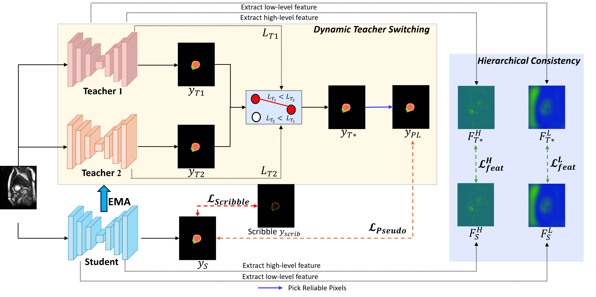

<div align="center">
  <h1 style="
    color:#4c6fff;
    font-style:italic;
    letter-spacing: 2px;
    text-shadow: 0 0 8px rgba(76,111,255,0.6);
  ">
    SDT-Net
  </h1>
</div>

Official code implementation of *"SDT-Net: Dynamic Teacher Switching with Hierarchical Consistency for Scribble-Supervised Medical Image Segmentation"*
### Introduction
The overall framework of SDTNet:


### Datasets and Model Weights
1. ACDC Dataset
- Mask Annotations: [ACDC](https://www.creatis.insa-lyon.fr/Challenge/acdc/) 
- Scribble annotations: [ACDC scribbles](https://vios-s.github.io/multiscale-adversarial-attention-gates/data)
2. MSCMR Dataset
- Mask Annotations: [MSCMRseg](https://zmiclab.github.io/zxh/0/mscmrseg19/data.html)
- Scribble annotations: [MSCMR_scribbles](https://github.com/BWGZK/CycleMix/tree/main/MSCMR_scribbles)
- Scribble-annotated dataset for training: [MSCMR_dataset](https://github.com/BWGZK/CycleMix/tree/main/MSCMR_dataset). 

> We have organized the datasets and our model checkpoints, and they are now available for download at: 👉 [Google Drive](https://drive.google.com/drive/folders/1OCPCEKdMr7Gh9v7xhSY5c_HF1e0TRkDL?usp=sharing)

### Setup
1. Clone this project and create a conda environment
```bash
git clone https://github.com/loc110504/SDTNET.git
cd SDTNET

conda create -n env python=3.10
conda activate env
```
2. Install requirements and packages
```bash
pip install -r requirements.txt
```
### Usage
1. For training:

```bash
cd code/train
python train_method_acdc.py # ACDC
python train_method_mscmr.py # MSCMRseg
```

2. For testing:
```bash
cd code/test
python test_acdc.py # ACDC
python test_mscmr.py # MSCMRseg
```

### Acknowledgement
We acknowledge the public release of [WSL4MIS](https://github.com/HiLab-git/WSL4MIS), [CycleMix](https://github.com/BWGZK/CycleMix) and [MAAG](https://github.com/gvalvano/multiscale-adversarial-attention-gates) for their codes and processed dataset.
